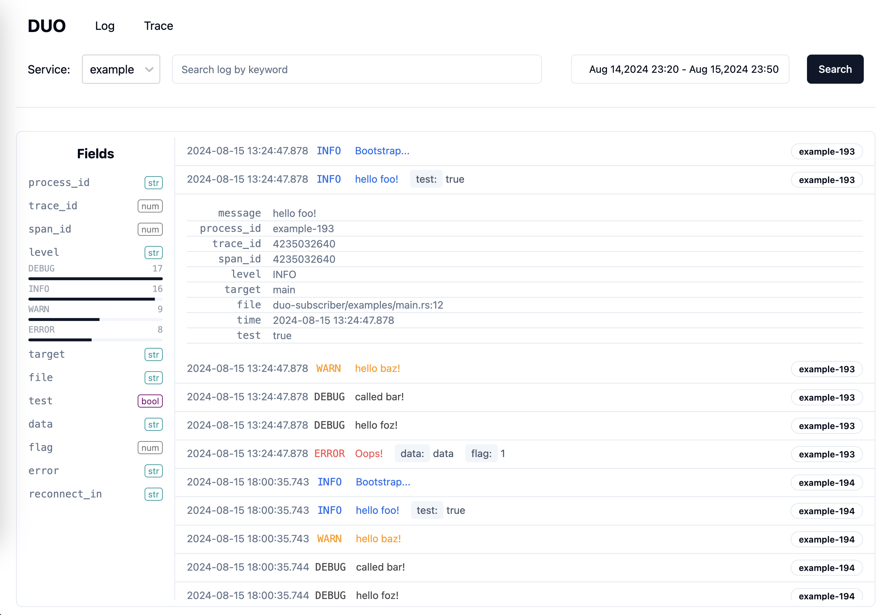
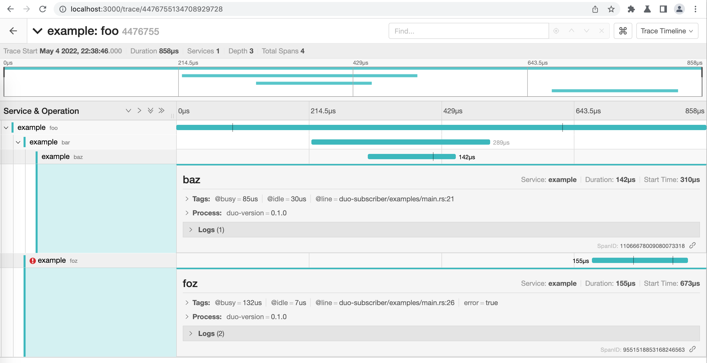

# Duo

[](https://crates.io/crates/duo)

[](./LICENSE)
[](https://deps.rs/repo/github/duo-rs/duo)

**A lightweight Logging and Tracing observability solution for Rust, built with [Apache Arrow](https://arrow.apache.org), [Apache Parquet](https://parquet.apache.org) and [Apache DataFusion](https://datafusion.apache.org).**

> **Notice: this project is in the experimental stage and not production-ready. Use at your own risk.**

## What is duo?

Duo is an easy-to-use observability solution that provides both logging and tracing capabilities for Rust applications. While traditional observability solutions are powerful (such as [ELK](https://elastic.co), [jaegertracing](https://jaegertracing.io), etc), it is also complex to deploy and maintain. Duo aimed to provide a less-powerful but complete set of observability features, with extremely simple deployment and maintenance.

This project was inspired by [tracing](https://github.com/tokio-rs/tracing) and [console](https://github.com/tokio-rs/console), which mainly consist of multiple components:

- **duo-api** - a wire protocol for logging and tracing data. The wire format is defined using gRPC and protocol buffers.
- **duo-subscriber** - instrumentation for collecting logging and tracing data from a process and exposing it over the wire format. `duo-subscriber` crate in this repository contains an implementation of the instrumentation-side API as a [tracing-subscriber](https://crates.io/crates/tracing-subscriber) [Layer](https://docs.rs/tracing-subscriber/latest/tracing_subscriber/layer/trait.Layer.html), for projects using Tokio and tracing.
- **duo-ui** - the web UI for duo.
- **duo-server** - the aggregating server to collect tracing and logging data and interact with duo web UI.

## Get started

### Installation

```
cargo install duo
```

Run `duo`.

```
$ duo

gRPC server listening on http://127.0.0.1:6000

Web server listening on http://127.0.0.1:3000
```

Open https://127.0.0.1:3000 at your local browser to wait application report data.

### Application

```toml
duo-subscriber = "0.1"
```

```rs
#[tokio::main]
async fn main() {
    let fmt_layer = fmt::layer();
    let uri = Uri::from_static("http://127.0.0.1:6000");
    let (duo_layer, handle) = DuoLayer::with_handle("example", uri).await;
    tracing_subscriber::registry()
        .with(fmt_layer)
        .with(duo_layer)
        .init();

    tracing::debug!("Bootstrap...");
    foo();

    handle.await.unwrap();
}
```

> For more example, please see [examples directory](./duo-subscriber/examples/).

Run your application then check the http://127.0.0.1:3000 to see the tracing data.

### Logging UI



### Tracing UI

Currently trace view is based on [Jaeger UI](https://www.jaegertracing.io), we'll rewrite it with Svelte in the future.



## Roadmap

- [x] Support tracing diagnosing with Jaeger UI.

- [x] Build duo web UI.

- [x] Support logging diagnosing.

- [x] Support arrow-ipc WAL.

- [x] Batch sync WAL to parquet files.

- [x] Support Object Store.

- [ ] Integrate Apache Iceberg?

- [ ] Support OpenTelemetry specification, aimed to be a lightweight OpenTelemetry backend.

## Why called duo?

Duo is mainly a musical terminology meaning a musical composition for two performers in which the performers have equal importance to the piece, often a composition involving two singers or two pianists.

The famous duo band is [Brooklyn Duo](https://www.youtube.com/c/BrooklynDuo), you can visit this video ([Canon in D (Pachelbel's Canon) - Cello & Piano](https://www.youtube.com/watch?v=Ptk_1Dc2iPY)) to learn more about them.


I personally think the logging and tracing have equal importance to observability, they are just like a duo band to help you diagnose your application.

## License

This project is licensed under the [MIT license](./LICENSE).
